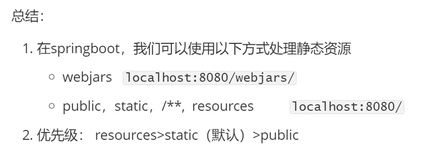
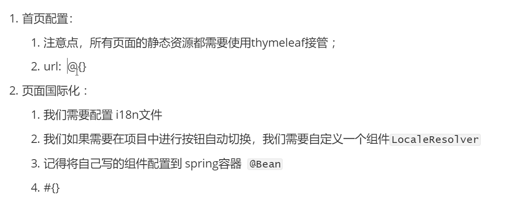

##### **1.spring自动装配的原理**

*Spring Boot启动的时候会通过@EnableAutoConfiguration注解找到META-INF/spring.factories配置文件中的所有自动配置类，并对其进行加载，而这些自动配置类都是以AutoConfiguration结尾来命名的，它实际上就是一个JavaConfig形式的Spring容器配置类，它能通过以Properties结尾命名的类中取得在全局配置文件中配置的属性如：server.port，而XxxxProperties类是通过@ConfigurationProperties注解与全局配置文件中对应的属性进行绑定的。*

##### 2.SpringBootWeb

* 2.1 SpringBoot中如何放置静态代码
  *tips：建议放在resource文件夹下的static文件夹里面，访问路径为 ‘localhost:8080/xxx’*
* 2.2我们可以创建自定义类实现 WebMvcConfigurer接口，然后实现其中的一些方法来完成自定义springMvc配置

  ```java
  @Configuration
  public class MyMvcConfig implements WebMvcConfigurer {}
  ```
* 2.3然后我们在配置拦截器之后，需要对静态文件进行放行处理，如下图

  ```java
      @Override
      public void addInterceptors(InterceptorRegistry registry) {
          registry.addInterceptor(new UserLoginInterceptor())
                  .addPathPatterns("/**")
                  .excludePathPatterns(
                          "/"
                          , "/index"
                          ,"/login"
                          ,"/css/**"
                          ,"/img/**"
                          ,"/js/**");
      }
  ```

##### 3.页面国际化与thymeleaf接管前端标签

* ###### 

  3.1利用动态的显示msg信息

  这句话用来提示用户密码正确与否，th:if="${not #xxxx} 的意思是当xxx不为空我们就显示这行信息"


  ```
  <p style="color: #0b2e13" th:text="${msg}" th:if="${not #strings.isEmpty(msg)}"></p>
  ```

*tip:*

想要取一些值目前有两种方法

1.th：text="${xxx}"

2.[[${xxx}]]

*变量表达式：$ {...} ”取变量用“
选择变量表达式：\* {...}
消息表达式：＃{...} "取消息用"
链接⽹址表达式：@ {...}
⽚段表达式：〜{...}*

如果设置完毕之后前台数据读取不到i18n properties文件的信息，而是直接显示前台写的 ”“里面的信息我们则需要在SpringBoot

全局配置文件中指明 ”i18n“ 配置文件的地址

```yaml
spring:
  messages:
    basename:
      i18n/login
```

* 使用自定义LocaleResolver类来实现地区转换的方法
  1.首先我们需要创建一个类并且实现LocalResolver接口
  2.实现接口里面的方法resolveLocale(),这个方法能够接收到前台的请求
  3.我们可以在请求链接中添加参数，来作为地区表示符号
  4.通过字符串游戏来处理传入的地区信息来创建一个地区对象
  5.该方法的返回值正好就是一个地区对象，所以我们根据请求参数来创建一个地区对象，然后将这个地区对象通过
  这个方法返回给浏览器请求头中，然后在根据我们写的i18n文件信息进行语言的转换
* 代码如下

  ```java
  public Locale resolveLocale(HttpServletRequest request) {
  //获取request信息中的地区参数
  String localMsg = request.getParameter("l");
  //获取地区信息,这个地区是获取的默认的
  Locale locale=Locale.getDefault();
  if(!StringUtils.isEmpty(localMsg)){
  //我们要处理字符串，取到请求消息里面的地区信息
  String[] local = localMsg.split("_");
  //创建一个Locale对象赋给locale变量并且返回
  locale=new Locale(local[0],local[1]);
  }
  return locale;
  }
  ```
* 创建完自定义的地区转换器之后我们需要在将他注册到spring容器里面

  所以我们需要在MvcConfig中注册bean
* ```java
     /*
     使用@Bean注解将这个组件注册到Spring容器中，注意你需要注册的组件的方法一定是该类名的首字母小写
      */
     @Bean
     public LocaleResolver localeResolver(){
         return new MyLocalResolver();
     }
  ```

##### 4.实现登录拦截器

在web项目中我们大多数都要对权限进行拦截，比如拦截没有登录的用户进入主页，具体步骤如下

* 4.1 在Controller中如果登录成功则将用户信息保存到Session中

  ```java
   @RequestMapping("/login")
      public String login(String username, String password, Model model, HttpSession session){
  //        判断账号密码正确吗，正确的话跳转到主页
          if(password.equals("001")){
              //登录成功的话，往session中存入一个属性
              session.setAttribute("userSession",username);
              return "redirect:/dashboard";
          }
          model.addAttribute("msg","用户或密码不正确！");
          return "/index";
      }
  }
  ```
* 4.2 创建自定义拦截器实现HanderInterceptor接口，重写其中的preHandle方法，判断Session中是否有对应的用户的Session属性值

  ```
  public class UserLoginInterceptor implements HandlerInterceptor {
      //登陆前拦截器，拦截没有正确登录的请求
      @Override
      public boolean preHandle(HttpServletRequest request, HttpServletResponse response, Object handler) throws Exception {
          //如果session是空的话，我们就拦截他的 请求，否则就放行
          if(request.getSession().getAttribute("userSession")==null){
              //存入一个msg
              request.setAttribute("msg","您没有权限，请先登录");
              //请求内跳转到登录页面
              request.getRequestDispatcher("/index").forward(request,response);
              return false;
          }
          return true;
      }
  }
  ```
* 4.3 在MvcConfig类中注册拦截器，并且设置放行与拦截的Url

  ```
      /*
      注册拦截器,设置需要拦截的以及需要放行的
       */
      @Override
      public void addInterceptors(InterceptorRegistry registry) {
          registry.addInterceptor(new UserLoginInterceptor()).addPathPatterns("/**").excludePathPatterns("/","/index",
                  "/login","/css/**","/img/**","/js/**");
      }
  ```

##### 5.实现显示所有用户操作

5.1 编写Controller

编写处理查询所有的用户信息Controller，需要接受请求，调用dao处理请求，通过转发（使用转发是要携带model数据）返回请求

```java
@Controller
public class EmployeeController {
    //自动注入EmployeeDao
    @Resource(name = "employeeDao")
    EmployeeDao employeeDao;
    /**
     * 获取全部员工信息
     * @return 跳转的页面
     */
    @RequestMapping("/getAllEmp")
    public String getAllEmployee(Model model){
        Collection<Employee> emps = employeeDao.getAllEmployee();
        model.addAttribute("emps",emps);
        return "forward:emplist";
    }
}
```

5.2处理前端页面

（1）首先将公共的页面部分提取出来

使用thymeleaf语法，使用th：fragment来标注这个公共标签的id

```xml
<nav class="col-md-2 d-none d-md-block bg-light sidebar" th:fragment="sidebar">
```

使用thymeleaf语法，使用 th:replace="文件夹/网页名称::标注的id(active='点击这个链接保存到active的数据')

```xml
<div th:replace="common/common::sidebar(active='dashboard')"></div>
```

（2）使用三元运算符判断那个页面处于激活状态并且将其高亮显示

```xml
<!--        我们每点击一个页面就会王active这个变量里面保存一个当前页面的消息，根据这个消息来判断当前是那个页面在激活-->
        <a th:class="${active=='dashboard'?'nav-link active':'nav-link'}" th:href="@{/dashboard}">
```

（3）使用thymeleaf语法将Controller传过来的用户列表依次便利出来然后显示到页面上

```html
<tr th:each="emp:${emps}">
	<td th:text="${emp.getId()}"></td>
	<td th:text="${emp.getLastName()}"></td>
	<td th:text="${emp.getEmail()}"></td>
	<td th:text="${emp.getSex()==0?'女':'男'}"></td>
        <td th:text="${emp.getDepartment().getDepartmentName()}"></td>
	<td th:text="${#calendars.format(emp.getBirthday(),'dd MMMM yyyy')}"></td>
	<td>
	    <button class="btn btn-sm btn-primary">编辑</button>
	    <button class="btn btn-sm btn-danger">删除</button>
	</td>
</tr>
```

##### 6.实现添加员工

* 6.1编写添加员工的html页面，复制网上的表单模板，然后修改其中的表单name值

  ```xml
  <form action="/emp" method="post">
  	<div class="form-group">
  	<label>姓名</label>
  	<input type="text" name="lastName" class="form-control" placeholder="海绵宝宝">
  	</div>
  	<div class="form-group">
  		<label>邮箱</label>
  		input type="email" name="email" class="form-control" placeholder="1176244270@qq.com">
  	</div>
  	<div class="form-group">
  		<label>性别</label><br>
  		<div class="form-check form-check-inline">
  		<input class="form-check-input" type="radio" name="sex" value="1">
  		<label class="form-check-label">男</label>
  		</div>
  		<div class="form-check form-check-inline">
  		<input class="form-check-input" type="radio" name="sex" value="0">
  		<label class="form-check-label">女</label>
  		</div>
  		</div>
  		<div class="form-group">
  		<label>部门</label>
  		<select class="form-control" name="department.id">
  <!--		循环便利全部的部门信息-->
  		<option th:each="department:${allDepartments}" th:text="${department.getDepartmentName()}" th:value="${department.getId()}"></option>
  		</select>
  		</div>
  		<div class="form-group">
  		<label>生日</label>
  		<input type="text" class="form-control" name="birthday" placeholder="嘤嘤嘤">
  		</div>
  		<button type="submit" class="btn btn-primary">添加</button>
  		</form>
  ```
* 6.2 编写跳转Controller
* 跳转到添加页面

  ```java
      @GetMapping("/emp")
      public String toAddEmp(Model model){
          Collection<Department> allDepartments = departmentDao.getAllDepartment();
          model.addAttribute("allDepartments",allDepartments);
          return "emp/add";
      }
  ```
* 处理添加请求，在执行完添加的dao之后一定要进行重定向操作，不然会报400一场

  ```java
      @PostMapping("/emp")
      public String addEmp(Employee employee){
          employeeDao.addEmployee(employee);
          return "redirect:/getAllEmp";
      }
  ```

##### 7.实现修改用户

* 7.1 首先我们需要编写一个restful风格的请求链接来跳转到修改页面，而且这个链接需要携带用户的id数据方便查询

  ```xml
  <!--这一句是以restful风格的封装，请求消息-->
  <a class="btn btn-sm btn-primary" th:href="@{/emp/}+${emp.id}">编辑</a>
  ```
* 7.2 然后我们需要编写跳转到修改页面的Controller，这个Controller不仅需要跳转页面也需要我们按照id查询用户信息

  ```java
      /**
       * 使用restful风格的接受Url，并且将Url携带的参数id绑定到 @PathVariable("id") Integer id 上
       * @param model 传递给前端的消息，用户与部门
       * @param id restful风格的接受的被更新用户的id
       * @return emp/update.html
       */
      @RequestMapping("/emp/{id}")
      public String toUpdateEmp(Model model, @PathVariable("id") Integer id){
          Employee emp = employeeDao.getEmployeeById(id);
          Collection<Department> departments = departmentDao.getAllDepartment();
          model.addAttribute("emp",emp);
          model.addAttribute("departments",departments);
          return "emp/update";
      }
  ```
* 7.3 然后我们就要开始着手编写修改用户的界面，这个界面还需要将后端传入的数据展示到前面，只摘取部分thymeleaf相关语法的标签

  ```xml
  <!--隐式的创建一个input，里面的value为我们选中的哪一个用户的id,来实现更新后台数据-->
  	<input type="hidden" name="id" th:value="${emp.id}">
  ```

  ```xml
   <!--循环便利全部的部门信息-->
   <!--这一行的意思是，如果便利出来的部门信息等于后端传过来的部门信息则选中这一行-->
  	<option th:checked="${department.id==emp.department.id}" th:each="department:${departments}" th:text="${department.getDepartmentName()}" th:value="${department.getId()}"></option>
  ```

  ```xml
  <input type="text" th:value="${#calendars.format(emp.birthday,'dd/MM/yyyy')}" class="form-control" name="birthday" placeholder="嘤嘤嘤">
  ```
* 7.4 然后我们就需要编写对于的controller，处理修改请求，然后重定向到用户信息列表

  ```java
      /**
       *
       * @param employee 被修改的用户信息
       * @return 重定向/getAllEmp
       */
      @RequestMapping("/updateEmp")
      public String updateEmp(Employee employee){
          employeeDao.addEmployee(employee);
          return "redirect:/getAllEmp";
      }


  ```

##### 8.实现用户删除与登出

* 8.1 实现用户删除和登出是比较简单的功能，首先对于用户删除来说我们需要一个发出请求的链接，然后这个链接需要携带用户id这个参数

  ```xml
  <a class="btn btn-sm btn-danger" th:href="@{/empdel/}+${emp.id}">删除</a>
  ```
* 8.2 有了请求链接之后自然的要写后端controller，他会根据前端传入的id执行删除dao并且重定向到用户信息页面

  ```java
  /**
       * 用户的删除操作
       * @param id restful风格传来的参数
       * @return 重定向/getAllEmp
       */
      @RequestMapping("/empdel/{id}")
      public String deleteEmp( @PathVariable("id") Integer id){
          employeeDao.deleteEmployee(id);
          return "redirect:/getAllEmp";
      }
  ```
* 8.3 对于用户登出，我们自然先需要写一个登出链接来发出请求

  ```xml
   <a class="nav-link" th:href="@{/logout}">Sign out</a>
  ```
* 8.4 有了请求之后也是进行controller处理请求，获取当前用户的session，然后

  ```java
   /**
       * 登出的Controller
       * @param session session
       * @return 重定向/index
       */
      @RequestMapping("/logout")
      public String logout(HttpSession session){
          Object userSession = session.getAttribute("userSession");
          if (userSession!=null){
              session.removeAttribute("userSession");
          }
          return "redirect:/index";
      }
  ```
*
